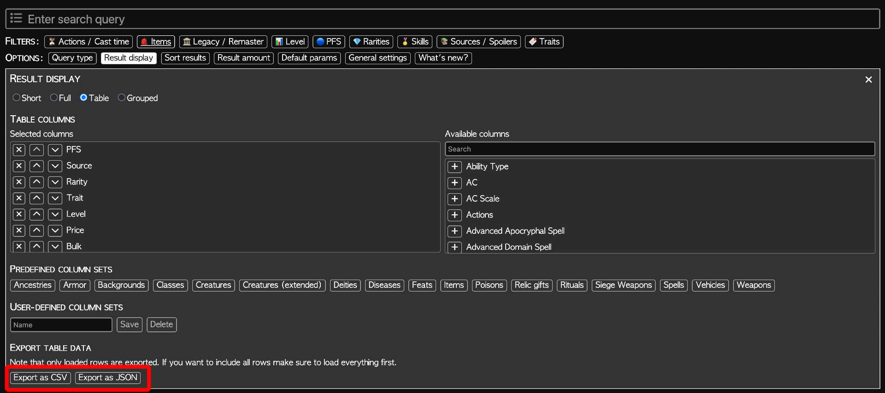

# FoundryVTT PF2E-AoN-Import

Take exported data tables from Archives of Nethys (AoN) and import them into FoundryVTT. Quickly setup well-populated shops!

Only works with the PF2E system.

## Features

* Read in JSON exports (items only!) from AoN (see Figure 1 below)
* Compare exported items to items within the FVTT Compendia
* Generate a Loot Actor containing those items.

## Installation

To install and use this module, simply paste the following URL into the Install Module dialog on the Setup menu of the application.

https://github.com/rayssharma/pf2e-aon-import/releases/latest/download/module.json

## Changelog

### v1.0.1

* Initial release, minimial viable functionality
